### Table of Contents
1. [Acknowledgements](#acknowledgements)
2. [Setting up, getting started](#setting-up-getting-started)
3. [Design](#design)
    - [Architecture](#architecture)
    - [UI Component](#ui-component)
    - [InternshipLogic Component](#internshiplogic-component)
    - [InternshipModel Component](#internshipmodel-component)
    - [InternshipStorage Component](#internshipstorage-component)
    - [Common classes](#common-classes)
4. [Implementation](#implementation)
    - [Sort](#sort-feature)
    - [Edit](#edit-feature)
    - [AddTask](#addtask-feature)
    - [SetDeadline](#setdeadline-feature)
    - [DeleteTask](#deletetask-feature)
    - [Remark](#remark-feature)
5. [Documentation, logging, testing, configuration, dev-ops](#documentation-logging-testing-configuration-dev-ops)
6. [Appendix: Requirements](#appendix-requirements)

--------------------------------------------------------------------------------------------------------------------

### **Acknowledgements**

* CareerSync's logo was generated using [LogoAI](https://www.logoai.com/logo-maker) and recreated for free using [Canva](https://www.canva.com/)
* GitHub [CoPilot](https://github.com/features/copilot) was used to assist the writing of the code in this project.

--------------------------------------------------------------------------------------------------------------------

### **Setting up, getting started**

Refer to the guide [_Setting up and getting started_](SettingUp.md).

--------------------------------------------------------------------------------------------------------------------

### **Design**

:bulb: **Tip:** The `.puml` files used to create diagrams in this document `docs/diagrams` folder. Refer to the [_PlantUML Tutorial_ at se-edu/guides](https://se-education.org/guides/tutorials/plantUml.html) to learn how to create and edit diagrams.

#### Architecture

The ***Architecture Diagram*** given above explains the high-level design of the App.

Given below is a quick overview of main components and how they interact with each other.

**Main components of the architecture**

**`Main`** (consisting of classes [`Main`](https://github.com/AY2324S2-CS2103T-W11-1/tp/blob/master/src/main/java/seedu/address/Main.java) and [`MainApp`](https://github.com/AY2324S2-CS2103T-W11-1/tp/blob/master/src/main/java/seedu/address/MainApp.java)) is in charge of the app launch and shut down.
* At app launch, it initializes the other components in the correct sequence, and connects them up with each other.
* At shut down, it shuts down the other components and invokes cleanup methods where necessary.

The bulk of the app's work is done by the following four components:

* [**`UI`**](#ui-component): The UI of the App.
* [**`InternshipLogic`**](#internshiplogic-component): The command executor.
* [**`InternshipModel`**](#internshipmodel-component): Holds the data of the App in memory.
* [**`Storage`**](#storage-component): Reads data from, and writes data to, the hard disk.

[**`Commons`**](#common-classes) represents a collection of classes used by multiple other components.

**How the architecture components interact with each other**

The *Sequence Diagram* below shows how the components interact with each other for the scenario where the user issues the command `delete 1`.

Each of the four main components (also shown in the diagram above),

* defines its *API* in an `interface` with the same name as the Component.
* implements its functionality using a concrete `{Component Name}Manager` class (which follows the corresponding API `interface` mentioned in the previous point.

For example, the `InternshipLogic` component defines its API in the `InternshipLogic.java` interface and implements its functionality using the `InternshipLogicManager.java` class which follows the `InternshipLogic` interface. Other components interact with a given component through its interface rather than the concrete class (reason: to prevent outside component's being coupled to the implementation of a component), as illustrated in the (partial) class diagram below.

The sections below give more details of each component.

#### UI component

The **API** of this component is specified in [`Ui.java`](https://github.com/AY2324S2-CS2103T-W11-1/tp/blob/master/src/main/java/seedu/address/ui/Ui.java)

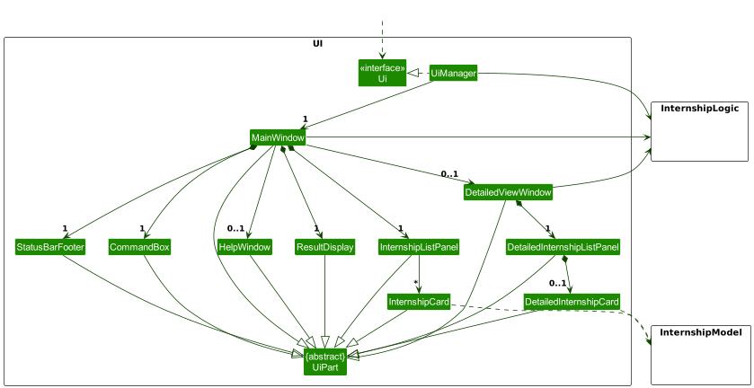

The UI consists of a `MainWindow` that is made up of parts e.g.`CommandBox`, `ResultDisplay`, `InternshipListPanel`, `StatusBarFooter` etc. All these, including the `MainWindow`, inherit from the abstract `UiPart` class which captures the commonalities between classes that represent parts of the visible GUI.

The `UI` component uses the JavaFx UI framework. The layout of these UI parts are defined in matching `.fxml` files that are in the `src/main/resources/view` folder. For example, the layout of the [`MainWindow`](https://github.com/AY2324S2-CS2103T-W11-1/tp/blob/master/src/main/java/seedu/address/ui/MainWindow.java) is specified in [`MainWindow.fxml`](https://github.com/AY2324S2-CS2103T-W11-1/tp/blob/master/src/main/resources/view/MainWindow.fxml)

The `UI` component,

* executes user commands using the `InternshipLogic` component.
* listens for changes to `Model` data so that the UI can be updated with the modified data.
* keeps a reference to the `InternshipLogic` component, because the `UI` relies on the `InternshipLogic` to execute commands.
* depends on some classes in the `Model` component, as it displays `Person` object residing in the `Model`.

#### InternshipLogic component

**API** : [`InternshipLogic.java`](https://github.com/AY2324S2-CS2103T-W11-1/tp/blob/master/src/main/java/seedu/address/InternshipLogic/InternshipLogic.java)

Here's a (partial) class diagram of the `InternshipLogic` component:

The sequence diagram below illustrates the interactions within the `InternshipLogic` component, taking `execute("delete 1")` API call as an example.

:information_source: **Note:** The lifeline for `DeleteCommandParser` should end at the destroy marker (X) but due to a limitation of PlantUML, the lifeline continues till the end of diagram.

How the `InternshipLogic` component works:

1. When `InternshipLogic` is called upon to execute a command, it is passed to an `InternshipDataParser` object which in turn creates a parser that matches the command (e.g., `DeleteCommandParser`) and uses it to parse the command.
1. This results in a `Command` object (more precisely, an object of one of its subclasses e.g., `DeleteCommand`) which is executed by the `InternshipLogicManager`.
1. The command can communicate with the `Model` when it is executed (e.g. to delete a person). 
   Note that although this is shown as a single step in the diagram above (for simplicity), in the code it can take several interactions (between the command object and the `Model`) to achieve.
1. The result of the command execution is encapsulated as a `CommandResult` object which is returned back from `InternshipLogic`.

Here are the other classes in `InternshipLogic` (omitted from the class diagram above) that are used for parsing a user command:

How the parsing works:
* When called upon to parse a user command, the `InternshipDataParser` class creates an `XYZCommandParser` (`XYZ` is a placeholder for the specific command name e.g., `AddCommandParser`) which uses the other classes shown above to parse the user command and create a `XYZCommand` object (e.g., `AddCommand`) which the `InternshipDataParser` returns back as a `Command` object.
* All `XYZCommandParser` classes (e.g., `AddCommandParser`, `DeleteCommandParser`, ...) inherit from the `Parser` interface so that they can be treated similarly where possible e.g, during testing.

#### InternshipModel component
**API** : [`InternshipModel.java`](https://github.com/AY2324S2-CS2103T-W11-1/tp/blob/master/src/main/java/seedu/address/model/InternshipModel.java)

The `Model` component,

* stores the internship data i.e., all `Internship` objects (which are contained in a `UniqueInternshipList` object).
* stores the currently 'selected' `Internship` objects (e.g., results of a search query) as a separate _filtered_ list which is exposed to outsiders as an unmodifiable `ObservableList<Internship>` that can be 'observed' e.g. the UI can be bound to this list so that the UI automatically updates when the data in the list change.
* stores a `InternshipUserPref` object that represents the user’s preferences. This is exposed to the outside as a `ReadOnlyInternshipUserPref` objects.
* does not depend on any of the other three components (as the `Model` represents data entities of the domain, they should make sense on their own without depending on other components)

#### InternshipStorage component

**API** : [`InternshipStorage.java`](https://github.com/AY2324S2-CS2103T-W11-1/tp/blob/master/src/main/java/seedu/address/storage/InternshipStorage.java)

The `InternshipStorage` component,
* can save both internship data and user preference data in JSON format, and read them back into corresponding objects.
* inherits from both `InternshipDataStorage` and `InternshipUserPrefsStorage`, which means it can be treated as either one (if only the functionality of only one is needed).
* depends on some classes in the `InternshipModel` component (because the `Storage` component's job is to save/retrieve objects that belong to the `InternshipModel`)

#### Common classes

Classes used by multiple components are in the `seedu.addressbook.commons` package.

--------------------------------------------------------------------------------------------------------------------

### **Implementation**

This section describes some noteworthy details on how certain features are implemented.

#### \[Proposed\] Undo/redo feature

#### Proposed Implementation

The proposed undo/redo mechanism is facilitated by `VersionedInternshipData`. It extends `InternshipData` with an undo/redo history, stored internally as an `internshipDataStateList` and `currentStatePointer`. Additionally, it implements the following operations:

* `VersionedInternshipData#commit()` — Saves the current address book state in its history.
* `VersionedInternshipData#undo()` — Restores the previous address book state from its history.
* `VersionedInternshipData#redo()` — Restores a previously undone address book state from its history.

These operations are exposed in the `InternshipModel` interface as `InternshipModel#commitInternshipData()`, `InternshipModel#undoInternshipData()` and `InternshipModel#redoInternshipData()` respectively.

Given below is an example usage scenario and how the undo/redo mechanism behaves at each step.

Step 1. The user launches the application for the first time. The `VersionedInternshipData` will be initialized with the initial internship data state, and the `currentStatePointer` pointing to that single internship data state.

Step 2. The user executes `delete 5` command to delete the 5th person in the internship data. The `delete` command calls `InternshipModel#commitInternshipData()`, causing the modified state of the internship data after the `delete 5` command executes to be saved in the `internshipDataStateList`, and the `currentStatePointer` is shifted to the newly inserted internship data state.

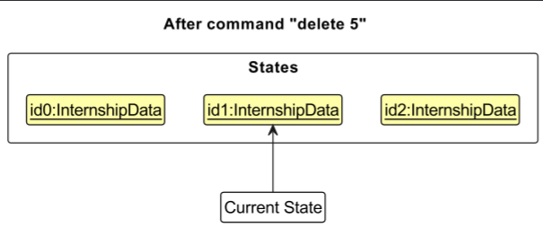

Step 3. The user executes `add n/David …​` to add a new internship. The `add` command also calls `InternshipModel#commitInternshipData()`, causing another modified internship data state to be saved into the `internshipDataStateList`.

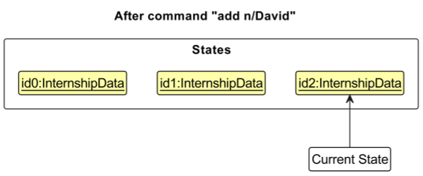

:information_source: **Note:** If a command fails its execution, it will not call `InternshipModel#commitInternshipData()`, so the address book state will not be saved into the `internshipDataStateList`.

Step 4. The user now decides that adding the internship was a mistake, and decides to undo that action by executing the `undo` command. The `undo` command will call `InternshipModel#undoInternshipData()`, which will shift the `currentStatePointer` once to the left, pointing it to the previous internship data state, and restores the internship data to that state.

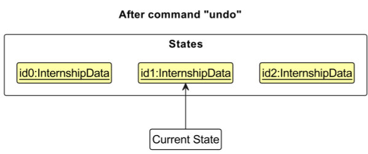

:information_source: **Note:** If the `currentStatePointer` is at index 0, pointing to the initial InternshipData state, then there are no previous InternshipData states to restore. The `undo` command uses `InternshipModel#canUndoInternshipData()` to check if this is the case. If so, it will return an error to the user rather
than attempting to perform the undo.

The following sequence diagram shows how an undo operation goes through the `InternshipLogic` component:

:information_source: **Note:** The lifeline for `UndoCommand` should end at the destroy marker (X) but due to a limitation of PlantUML, the lifeline reaches the end of diagram.

Similarly, how an undo operation goes through the `Model` component is shown below:

The `redo` command does the opposite — it calls `InternshipModel#redoInternshipData()`, which shifts the `currentStatePointer` once to the right, pointing to the previously undone state, and restores the internship data to that state.

:information_source: **Note:** If the `currentStatePointer` is at index `internshipDataStateList.size() - 1`, pointing to the latest internship data state, then there are no undone InternshipData states to restore. The `redo` command uses `InternshipModel#canRedoInternshipData()` to check if this is the case. If so, it will return an error to the user rather than attempting to perform the redo.

Step 5. The user then decides to execute the command `list`. Commands that do not modify the internship data, such as `list`, will usually not call `InternshipModel#commitInternshipData()`, `InternshipModel#undoInternshipData()` or `InternshipModel#redoInternshipData()`. Thus, the `internshipDataStateList` remains unchanged.

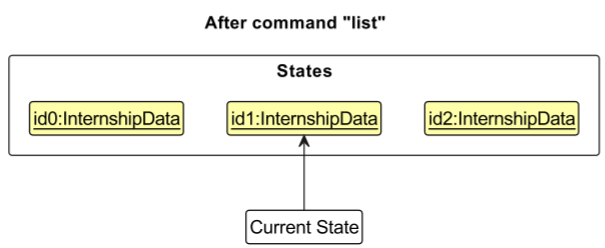

Step 6. The user executes `clear`, which calls `InternshipModel#commitInternshipData()`. Since the `currentStatePointer` is not pointing at the end of the `internshipDataStateList`, all internship data states after the `currentStatePointer` will be purged. Reason: It no longer makes sense to redo the `add n/David …​` command. This is the behavior that most modern desktop applications follow.

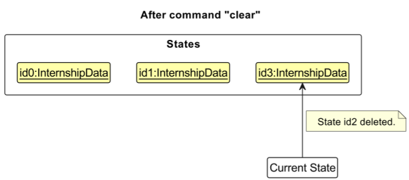

The following activity diagram summarizes what happens when a user executes a new command:

#### Design considerations:

**Aspect: How undo & redo executes:**

* **Alternative 1 (current choice):** Saves the entire internship data.
    * Pros: Easy to implement.
    * Cons: May have performance issues in terms of memory usage.

* **Alternative 2:** Individual command knows how to undo/redo by
  itself.
    * Pros: Will use less memory (e.g. for `delete`, just save the person being deleted).
    * Cons: We must ensure that the implementation of each individual command are correct.

_{more aspects and alternatives to be added}_

### \[Proposed\] Data archiving

_{Explain here how the data archiving feature will be implemented}_

### Sort feature
This feature allows users to sort the list of internships based on any one of the fields in ascending or descending order.
The method takes in the field to sort by and the order of sorting as arguments.
The method then uses a comparator to sort the list of internships based on the specified field and order.
The sort feature is primarily implemented in the `InternshipModelManager` class.

Here is a step-by-step example of how the `sort` command might be executed:

1. User inputs the `sort /com asc` command. 
2. `InternshipDataParser` parses the command and creates a new `InternshipSortCommandParser` object. 
3. The `InternshipSortCommandParser` then calls `ArgumentTokenizer::tokenize` to extract the field and order of sorting. 
   If the field or order is missing, a ParseException will be thrown. 
4. The `InternshipSortCommandParser` then creates a new `InternshipSortCommand` object with the extracted details. 
5. The `InternshipSortCommand::execute` method is called, checking if the field is valid and the order is valid. 
   If the field is invalid, a CommandException will be thrown. 
6. The relevant comparator is gotten using the `InternshipSortCommandParser::getComparator` method, and it is passed into the `InternshipModel::sortFilteredInternshipList` method. 
7. The `InternshipModel::sortFilteredInternshipList` class sorts the list of internships based on the comparator and updates the `sortedInternshipList`.  
8. Now when the `UI` component requests the list of internships via the `InternshipModel::getFilteredInternshipList` method, it gets the sorted list of internships. 

#### Design considerations:
* **Aspect: How the sorting is done:**
    * **Alternative 1 (current choice):** Uses a comparator to sort the list of internships.
        * Pros: Easy to implement.
        * Cons: May have performance issues in terms of memory usage.
    * **Alternative 2:** Uses a different data structure to store the internships.
        * Pros: May have better performance.
        * Cons: May be more complex to implement.
* **Aspect: How the arguments are parsed:**
    * **Alternative 1 (current choice):** Uses Enum classes to represent the fields and order of sorting.
        * Pros: Ensures type safety.
        * Cons: May be more complex to implement.
    * **Alternative 2:** Uses strings to represent the fields and order of sorting.
        * Pros: Easier to implement.
        * Cons: May lead to runtime errors due to typos.

### Edit feature
The `edit` feature allows users to modify the details of an existing internship entry. This method takes in the index of
the internship, the fields to be edited and the value of the fields as arguments. This method then updates all the fields 
given. All fields except for `TaskList` are modifiable. To modify `TaskList`, the commands `addtask` and `deletetask` should be used.

Here is a step-by-step example of how the `edit` command might be executed:

1. The user inputs the `edit` command, passing in the relevant arguments. 
2. `InternshipDataParser` parses the command and creates a new `InternshipEditCommandParser` object. 
3. The `InternshipEditCommandParser` then calls `ArgumentTokenizer::tokenize` to extract the index and the fields to be edited. 
If there are no prefixes, no index, invalid index or duplicate prefixes, a ParseException will be thrown. 
4. The `InternshipEditCommandParser` then creates a new `InternshipEditCommand` object with the extracted details. 
5. The `InternshipEditCommand::execute` method is called, checking if the edited internship already exists with `Internship::isSameInternship` and `InternshipModel::hasInternship`. 
A CommandException will be thrown in the event of duplicate internships. 
6. The old internship object is replaced with the new internship object using `InternshipModel::setInternship` . 
7. `InternshipModel::updateFilteredInternshipList(PREDICATE_SHOW_ALL_INTERNSHIPS)` is then called to update the internship displayed on the `UI`. 
All internships will be shown on the `UI`.

#### Design Considerations
In v1.2, the `edit` command initially allows users to edit all fields of an internship entry. In v1.3, with the addition of
`Remark` and `TaskList`, we decide to have an additional command called `addremark` so that users can add remarks directly
without using the `edit` command, with consideration that this field may be changed rather frequently. We preserved the ability
to edit `Remark` using the `edit` command as it is more intuitive for the users.

The `TaskList` field is not editable using the `edit` command, making it the only uneditable field using `edit`. The modification of 
tasks is facilitated using `addtask`, `deletetask` and `setdeadline` commands. As editing `TaskList` directly is not intuitive,
we decide to remove the `edit` command's ability to modify `TaskList` directly.

The fields to determine if an internship is the same as another internship are `Company Name`, `Contact Name`, `Contact Phone`,
`Contact Email`, `Role` and `Location`. `Application Status`, `Remark` and `Tasks` are excluded. Rationale is explained under the `add` command.

### AddTask feature
The `addtask` command allows users to add tasks to the `TaskList` field of an existing internship entry. This allows users to
keep track of the tasks they need to complete for each internship. The `TaskList` field contains an `ArrayList<Task>` field
that stores the tasks for each internship. The `addtask` command directly adds a new `Task` object to the `TaskList` field
of the internship entry.

This method takes in the index of the internship, and the task to be added. It then adds the task to the internship with the index.

Here is a step-by-step example of how the `addtask` command might be executed:

1. The user inputs the `addtask` command. 
2. The `InternshipDataParser` parses the command and creates a new `InternshipAddTaskParser` object. 
3. The `InternshipAddTaskParser` then calls the `ArgumentTokenizer::tokenize` to extract the index and the task to be added. 
If either the index or the task is either missing or invalid, a ParseException will be thrown. 
4. The `InternshipAddTaskParser` then creates a new `InternshipAddTaskCommand` object with the extracted details. 
If the index is larger than the number of internships displayed, a CommandException will be thrown. 
5. The `InternshipAddTaskCommand::execute` method is called, creating a new `Task` object based on the details. It then adds the task to the `TaskList` field of the internship entry via `TaskList::addTask`. 
6. The `InternshipAddTaskCommand` then calls `InternshipModel::setInternship` to replace the old internship with the new one with the task. 
7. The `InternshipAddTaskCommand` then calls `InternshipModel::updateFilteredInternshipList(PREDICATE_SHOW_ALL_INTERNSHIPS)` to update the internship displayed on the UI. 

### SetDeadline feature
The `setdeadline` command allows users to set a deadline for a `Task` in the `TaskList` field of an existing internship entry.
To use this command, the user needs to specify both the internship index and the task index as displayed in the screen, in addition
to specifying the deadline. The `setdeadline` command directly replaces the deadline of the specified `Task` in the `TaskList` field
of the internship entry. The default deadline is `null`, and is displayed as a blank space in the UI.

Here is a step-by-step example of how the `setdeadline` command might be executed:

1. The user inputs the `setdeadline` command. 
2. The `InternshipSetDeadlineParser` then calls the ``ArgumentTokenizer::tokenize`` method to extract the internship index, task index and the deadline. 
If either the internship index, task index or the deadline is either missing or invalid, a ParseException will be thrown. 
3. The `InternshipSetDeadlineParser` then creates an `InternshipSetDeadlineCommand` object with the extracted details. 
4. The `InternshipSetDeadlineCommand::execute` method is called. The Internship is accessed via the given indexes, and the task with the corresponding task index has its deadline set via `setDeadline`. 
   If the internship index is larger than the number of internships displayed, a CommandException will be thrown. 
   If the task index is larger than the number of tasks in the `TaskList` field of the internship, a CommandException will be thrown. 
5. The `InternshipSetDeadlineCommand` then calls `InternshipModel::setInternship` to trigger a UI update. 
6. The `InternshipSetDeadlineCommand` then calls `InternshipModel::updateFilteredInternshipList(PREDICATE_SHOW_ALL_INTERNSHIPS)` to update the internship displayed on the UI. 

#### Design Considerations
For the deadline field's default value, we can have it either be null, or a default date that should not be used by any
regular user. We decided to have the default value be null, as we do not want to cause confusion for users who do not want
to set a deadline. 
A proposed improvement to this feature is to have the `isValidDeadline` not just check if it is a valid Java date, but also
check that it is a valid calendar date that is not in the past. 

#### Aspect: Default value of deadline saved
* **Alternative 1 (current choice):** Default value of deadline is null.
    * Pros: More intuitive for users.
    * Cons: May cause NullException issues when used for `equals` comparison.
    * Solution: Have a `isDeadlineSet` boolean field in `Task` to check if the deadline is set.
* **Alternative 2:** Default value of deadline is a default date.
    * Pros: Users will not forget to set a deadline.
    * Cons: May cause confusion for users who do not want to set a deadline.

### DeleteTask feature
The `deletetask` command allows users to delete a `Task` from the `TaskList` field of an existing internship entry.
To use this command, the user needs to specify both the internship index and the task index as displayed in the screen.
The `deletetask` command selects the specified `Task` in the `TaskList` field of the internship entry and removes it from its
`ArrayList<Task> TaskList` field which stores the `Task` objects.

Here is a step-by-step example of how the `deletetask` command might be executed:

1. The user inputs the `deletetask` command.
2. The `InternshipDataParser` parses the command and creates a new `InternshipDeleteTaskCommandParser` object.
If either the internship index or the task index is either missing or invalid, a ParseException will be thrown.
3. The `InternshipDeleteTaskCommandParser` then creates a new `InternshipDeleteTaskCommand` object with the extracted details.
4. The `InternshipDeleteTaskCommand::execute` method is called. The Internship is accessed via the given indexes, and the task with the corresponding task index is deleted.
   If the internship index is larger than the number of internships displayed, a CommandException will be thrown. 
   If the task index is larger than the number of tasks in the `TaskList` field of the internship, a CommandException will be thrown. 
5. The `InternshipDeleteTaskCommand` then calls `InternshipModel::setInternship` to trigger a UI update. 
6. The `InternshipDeleteTaskCommand` then calls `InternshipModel::updateFilteredInternshipList(PREDICATE_SHOW_ALL_INTERNSHIPS)` to update the internship displayed on the UI. 

### Remark Feature
This feature enables users to add or modify remarks for each internship entry.
All internships are initialised with a blank remark field. 
The `addremark` command takes in the index of the internship and the remark to be added. A new internship object is created that contains the new remark, and the internship entry is updated with the new one.

Here is a step-by-step example of how the `addremark` command might be executed:

1. The user inputs the `addremark` command.
2. The `InternshipDataParser` parses the command and creates a new `InternshipRemarkCommandParser` object.
3. The `InternshipRemarkCommandParser` then calls `ArgumentTokenizer::tokenize` to extract the index and the remark to be added.
   If either the internship index or the remark is missing, or duplicate prefixes are present, a ParseException will be thrown.
4. The `InternshipRemarkCommandParser` then creates a new `InternshipRemarkCommand` object with the extracted details.
5. The `InternshipRemarkCommand::execute` method is called. A new Internship object is created, with the remark field updated.
6. The `InternshipRemarkCommand` then calls `InternshipModel::setInternship` to update the internship entry with the new one.
7. The `InternshipRemarkCommand` then calls `InternshipModel::updateFilteredInternshipList(PREDICATE_SHOW_ALL_INTERNSHIPS)` to update the internship displayed on the UI.

#### Design considerations
#### Aspect: Deleting Remarks
* **Alternative 1 (current choice):** Deleting remarks is done via addremark with a blank remark.
    * Pros: Simpler implementation.
    * Cons: Not as intuitive as having a `deleteremark` command
* **Alternative 2:** Implement a `deleteremark` command.
    * Pros: More intuitive for the user.
    * Cons: More complex implementation and documentation needed.

--------------------------------------------------------------------------------------------------------------------

### **Documentation, logging, testing, configuration, dev-ops**

* [Documentation guide](Documentation.md)
* [Testing guide](Testing.md)
* [Logging guide](Logging.md)
* [Configuration guide](Configuration.md)
* [DevOps guide](DevOps.md)

--------------------------------------------------------------------------------------------------------------------

### **Appendix: Requirements**

#### Product scope

**Target user profile**: People sourcing for internships (specifically, CS students)

* has a need to manage a significant number of internship applications
* prefer desktop apps over other types
* can type fast
* prefers typing to mouse interactions
* is reasonably comfortable using CLI apps

**Value proposition**:

Effortlessly manage, search, and sift through your various internship applications.
Enter details rapidly using CLI, and avoid losing track of crucial information.
Targeted to those with numerous applications to keep track of and prefer using CLI.
Your all-in-one solution for seamless application management.

#### User stories

**Priorities**: High (Must-Have) - `* * *`, Medium (Nice-To-Have) - `* *`, Low (Not Useful) - `*`

| Priority | As a/an...     | I can...                                                                                  | So that...                                                                                                                                  |
|--------|----------------|-------------------------------------------------------------------------------------------|---------------------------------------------------------------------------------------------------------------------------------------------|
| `***`  | user           | modify internship details                                                                 | I can keep myself updated on changing details.                                                                                              |
| `***`  | user           | enter internship information from the main page                                           | I can quickly note down potential internships at a career fair.                                                                             |
| `**`    | new user       | access sample data in the app                                                             | I can play around with the features to get the hang of them.                                                                                |
| `***`   | user           | view all internship details                                                               | I can easily view all details in one screen.                                                                                                |
| `***`   | user           | update the status of an internship application                                            | I can easily see my general status of all my applications.                                                                                  |
| `***`   | user           | add information about the internship application                                          | I can customize to see internships that fall under specific fields.                                                                         |
| `**`    | efficient user | filter by company                                                                         | I can view all the internships from the same company and understand how a company hires.                                                    |
| `**`    | efficient user | filter by point of contact                                                                | I can view all the internships that are associated to the same person of contact.                                                           |
| `**`    | efficient user | filter by location                                                                        | I can view all the internships that have the same working mode or location.                                                                 |
| `**`    | efficient user | filter by application status                                                              | I can view all the internships that are pending.                                                                                            |
| `**`    | user           | see the tasks of my applications                                                          | I know what tasks do I have for my internship applications.                                                                                 |
| `**`    | user           | add tasks to my internship entries                                                        | I can create tasks for my internship applications.                                                                                          |
| `**`    | user           | set deadlines for each task                                                               | I won't miss deadlines and get tasks done on time.                                                                                          |
| `**`    | user           | delete tasks from my internship entries                                                   | I know what tasks do I have for my internship applications.                                                                                 |
| `**`    | efficient user | sort applications in the order of remark                                                  | I can view the applications that I have added a remark to first.                                                                            |
| `**`    | efficient user | sort applications in order of working mode or location                                    | I can view the internships in the order of what I have working mode/location information about, i.e unkowns will be pushed down to the end. |
| `**`    | efficient user | sort applications in order of roles                                                       | I can view the internships in the order of what I have role information about, i.e empty roles will be pushed down to the end.              |
| `**`    | efficient user | sort applications in the order of what I need to attend to first                          | I can see the applications that need to be applied followed by those pending/ongoing followed by accepted and rejected.                     |
| `**`    | new user       | view all the commands and their details                                                   | I can learn to use the app faster.                                                                                                          |
| `**`    | user           | have different status with their own colours                                              | it is visually easier to identify applications with different status.                                                                       |
| `**`   | user           | have a detailed view for an internship                                                    | I can see all the details for the internship I want to focus on.                                                                            |
| `**`   | user           | find internships that satisfy multiple fields at once                                     | I can filter and view the internships of interest.                                                                                          |
| `**`   | user           | find internships that contain any of the several given strings in their respective fields | I can search for specific internships which have certain keywords.                                                                          |
| `**`   | user           | find internships that contain all of the given strings in their respective fields         | I can search for specific internships which have certain keywords.                                                                          |

#### Use cases

(For all use cases below, the **System** is `CareerSync` and the **Actor** is the `user`, unless specified otherwise)

**Use case: Enter Internship Information From The Main Page**

**MSS**

1. User accesses the main page. 
2. User selects the option to enter internship information. 
3. System prompts the user to input internship details such as company name, role title, description, etc. 
4. User inputs the required internship details. 
5. System validates the input data. 
6. System saves the internship information. 
7. System displays a confirmation message indicating successful submission.

    Use case ends.

**Extensions**

* 1a. User is unable to access the main page.
    *1a1. System displays an error message.
* 2a. User cancels entering internship information.
  * 2a1. System cancels the entry process and returns the user to the main page.
* 5a. User inputs invalid internship details.
  * 5a1. System displays an error message indicating the specific validation error(s).
* 6a. System fails to save the internship information.
  * 6a1. System displays an error message and prompts the user to retry or cancel the submission.

    Use case ends.

**Use case: Access All Commands Via A Text-Based Input**

**MSS**

1. User accesses the main page. 
2. System displays a prompt for text-based input. 
3. User enters a command using text-based input. 
4. System recognizes and processes the entered command. 
5. System executes the requested action corresponding to the entered command. 
6. User receives feedback or output based on the executed command.

    Use case ends.

**Extensions**

* 1a. User is unable to access the main page.
  * 1a1. System displays an error message.
* 3a. User enters an invalid command.
  * 3a1. System displays an error message indicating that the command is not recognized.
* 4a. System fails to recognize or process the entered command.
  * 4a1. System displays an error message and prompts the user to retry or enter a different command.
* 5a. System encounters an error while executing the requested action.
  * 5a1. System displays an error message and prompts the user to retry or perform a different action.

    Use case ends.

**Use case: Access Sample Data In The App**

**MSS**

1. User accesses the main page. 
2. User selects the option to access sample data. 
3. System retrieves and displays sample internship data. 
4. User views the sample internship data presented by the system.

    Use case ends.

**Extensions**

* 1a. User is unable to access the main page.
  * 1a1. System displays an error message.
* 2a. User cancels accessing sample data.
  * 2a1. System cancels the process and returns the user to the main page.
* 3a. System fails to retrieve sample data.
  * 3a1. System displays an error message and prompts the user to retry or exit.
* 4a. User encounters issues while viewing the sample data.
  * 4a1. System displays an error message and prompts the user to retry or exit.

    Use case ends.

**Use case: Modify Internship Details**

**MSS**

1. User accesses the main page. 
2. User selects the option to view all internship details. 
3. System retrieves and displays a list of all entered internship details. 
4. User selects the internship entry to be modified. 
5. System presents the selected internship details for editing. 
6. User modifies the necessary internship details. 
7. System validates the modified data.
8. System saves the updated internship information. 
9. System displays a confirmation message indicating successful modification.

    Use case ends.

**Extensions**

* 1a. User is unable to access the main page.
  * 1a1. System displays an error message.
* 2a. User cancels viewing all internship details.
  * 2a1. System cancels the process and returns the user to the main page.
* 4a. User cancels selecting the internship entry to be modified.
  * 4a1. System cancels the modification process and returns the user to the list of internship details.
* 6a. User inputs invalid internship details.
  * 6a1. System displays an error message indicating the specific validation error(s).
* 7a. System fails to validate the modified data.
  * 7a1. System displays an error message and prompts the user to correct the data.
* 8a. System fails to save the updated internship information.
  * 8a1. System displays an error message and prompts the user to retry or exit.

    Use case ends.

**Use case: View All Internship Details**

**MSS**

1. User accesses the main page. 
2. User selects the option to view all internship details. 
3. System retrieves and displays a list of all entered internship details. 
4. User views the list of internship details presented by the system.

    Use case ends.

**Extensions**

* 1a. User is unable to access the main page.
  * 1a1. System displays an error message.
* 2a. User cancels viewing all internship details.
  * 2a1. System cancels the process and returns the user to the main page.
* 3a. System fails to retrieve all internship details.
  * 3a1. System displays an error message and prompts the user to retry or exit.

    Use case ends.

**Use case: Add Information To The Notes Section Of An Entry**

**MSS**

1. User accesses the main page. 
2. User selects the option to view all internship details.
3. System retrieves and displays a list of all entered internship details.
4. User selects the internship entry to which notes will be added.
5. System presents the selected internship details along with the current notes section.
6. User enters additional information in the notes section.
7. System saves the updated notes.
8. System displays a confirmation message indicating successful addition of notes.

   Use case ends.

**Extensions**

* 1a. User is unable to access the main page.
  * 1a1. System displays an error message.
* 2a. User cancels viewing all internship details.
  * 2a1. System cancels the process and returns the user to the main page.
* 4a. User cancels selecting the internship entry to add notes.
  * 4a1. System cancels the process and returns the user to the list of internship details.
* 6a. User encounters an error while adding notes.
  * 6a1. System displays an error message and prompts the user to retry or exit.
* 7a. System fails to save the updated notes.
  * 7a1. System displays an error message and prompts the user to retry or exit.

    Use case ends.

*{More to be added}*

#### Non-Functional Requirements

1.  Should work on any _mainstream OS_ as long as it has Java `11` or above installed.
2.  Should be able to hold up to 100 internship entries without a noticeable sluggishness in performance for typical usage.
3.  A user with above average typing speed for regular English text (i.e. not code, not system admin commands) should be able to accomplish most of the tasks faster using commands than using the mouse.
4.  Storage of data should be in a format that is easy to read and write by humans, and easy to parse by machines.
5.  System should be backward compatible with data produced by earlier versions of the system.
6.  System is expected to be used by a single user on a machine, and does not need to support multiple users on the same machine.
7.  System should launch within 2 seconds on any modern machine.

*{More to be added}*

#### Glossary

* **API**: Application Programming Interface. The entirety of published methods, properties and other means for software developers to access an application through software they write using this application.
* **GUI**: Graphical User Interface.  A graphical user interface uses graphical representations of commands, status feedbacks and data of an application, and offers methods to interact with it through graphical devices, such as a mouse or tablets.
* **Internship Details**: Information about an internship, such as the company name, contact name, email, role etc. Refer to [User Guide Field Summary](UserGuide.md#field-summary) for more details.
* **JAR**: Java ARchive. A package file format typically used to aggregate many Java class files and associated metadata and resources (text, images, etc.) into one file for distribution.
* **JSON**: JavaScript Object Notation. A lightweight data-interchange format that is human-readable.
* **Mainstream OS**: Mainstream Operating Systems. Refers to Windows, Linux, Unix and MacOS.
* **UI**: User Interface. The point where a user and a software application meet and interact.

--------------------------------------------------------------------------------------------------------------------

### **Appendix: Instructions for manual testing**

Given below are instructions to test the app manually.

:information_source: **Note:** These instructions only provide a starting point for testers to work on;
testers are expected to do more *exploratory* testing.

#### Launch and shutdown

1. Initial launch

    1. Download the CareerSync.jar file and copy into an empty folder

    1. Double-click the jar file Expected: Shows the GUI with a set of sample contacts. The window size may not be optimum.
   
   2. Alternatively run the jar file from the command line with `java -jar CareerSync.jar` Expected: Same as above.

1. Saving window preferences

    1. Resize the window to an optimum size. Move the window to a different location. Close the window.

   2. Re-launch the app by double-clicking the jar file. 
       Expected: The most recent window size and location is retained.

3. Exiting the app

    1. Click the close button on the window. 
       Expected: The app closes.

   2. Use the `exit` command. 
       Expected: The app closes.

#### Deleting a person

1. Deleting a person while all persons are being shown

    1. Prerequisites: List all persons using the `list` command. Multiple persons in the list.

    1. Test case: `delete 1` 
       Expected: First contact is deleted from the list. Details of the deleted contact shown in the status message. Timestamp in the status bar is updated.

    1. Test case: `delete 0` 
       Expected: No person is deleted. Error details shown in the status message. Status bar remains the same.

    1. Other incorrect delete commands to try: `delete`, `delete x`, `...` (where x is larger than the list size) 
       Expected: Similar to previous.

1. _{ more test cases …​ }_

#### Saving data

Make sure to use the `exit` command or the close button to save data while closing the app.

1. Dealing with missing/corrupted data files

    1. To simulate a missing data file, delete the data file(`./data/internshipdata.json`) before launching the app. You will notice that the app automatically creates a new data file and repopulates it with sample data. To remove the sample data, enter the `clear` command.
   
   2. To simulate a corrupted data file, edit the data file to contain some random text. Launch the app. The app should detect the corrupted file and automatically replace it with a new empty data file. You can then add new data to the app or reset the data to sample data by deleting the data file.

1. _{ more test cases …​ }_

### Finding internships
For all the following test cases:

Prerequisites: Delete the data file (`./data/internshipdata.json`) before launching the app to populate the app with sample data.
Then, list all internships using the `list` command.
1. Filtering by company name
   1. **Test case**: `find withall /com Amazon` 
       **Expected**: 1 internship with the name 'Amazon' is shown. The status message shows how many internships were listed.

   2. **Test case**: `find withall /com TikTok` 
      **Expected**: No internships are shown. The status message shows how many internships were listed.

   3. **Test case**: `find withall /com` 
      **Expected**: Visible internships do not change. The status message shows an error message about needing at least one search keyword. 
2. Filtering using `withall`
   1. **Test case**: `find withall /loc remote /status TO_APPLY` 
      **Expected**: 1 internship with both location 'REMOTE' and status 'TO_APPLY' is shown. The status message shows how many internships were listed.
3. Filtering using `withany`
    1. **Test case**: `find withany /com Amazon /status TO_APPLY` 
       **Expected**: 2 internships with the company name 'Amazon' or status 'TO_APPLY' are shown. The status message shows how many internships were listed.
3. Filtering with invalid mode
   1. **Test case**: `find /com Amazon` 
      **Expected**: Visible internships do not change. The status message shows an error message about invalid mode specified.
   2. **Test case**: `find withInvalidMode /status pending`
      **Expected**: Visible internships do not change. The status message shows an error message about invalid mode specified.
4. Filtering with unsupported prefix `/phone`
    1. **Test case**: `find withall /phone 12345678` 
       **Expected**: Visible internships do not change. The status message shows an error message about unsupported prefix.

### Sort Feature
1. Prerequisites: Delete the data file (`./data/internshipdata.json`) before launching the app to populate the app with sample data.
2. Add another internship entry using the following command: `add /com Amazon /desc create new recommendation engine /status ongoing /poc jane yeo /email hr@tiktok.com /phone 9089030 /loc remote /role Business Development Intern`

    1. **Test case**: `sort /status desc` 
       **Expected**: The list of internships is sorted in the order: `Rejected -> Accepted -> Pending -> Ongoing -> To Apply`. The status message shows how many internships were sorted successfully.

    2. **Test case**: `sort /status asc`  
       **Expected**: The list of internships is sorted in the order: `To Apply -> Ongoing -> Pending -> Accepted -> Rejected`. The status message shows how many internships were sorted successfully.
       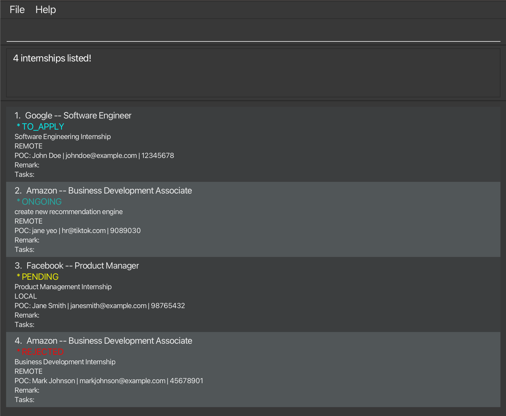 

    3. **Test case**: `sort /com asc` 
       **Expected**: The list of internships is sorted in alphabetical order of the company name. The status message shows how many internships were sorted successfully. Note that this test case allows you to see how the sort is layered on top of each other. The two Amazon internships are de-conflicted based on the previous sort command. This is why the ongoing internship is listed first.
        

--------------------------------------------------------------------------------------------------------------------

## **Appendix: Planned Enhancements**
Note that to try out the below example commands you will need to reset the data to sample data. This can be done by deleting the `data` folder in the project directory and restarting the application.
1. **Case insensitivity for all commands and fields:** Currently, CareerSync strictly only allow lower case commands and prefixes. Case insensitivity will enhance user experience as CLI users can input commands faster and with fewer syntax errors.
2. **Return to default chronological sort** Currently, there is no way to return to the default chronological order (sorted by time of addition) after using the sort command. This can be confusing for users who are not familiar with the application. In the future we plan to add a command to return to the default chronological sort.
3. **Email field does not require domain name** Currently, `example@gmail` is considered a valid email and there is no requirement for a proper domain (eg: .com). This is a constraint we want to enforce to reduce users mistyping emails.
     Command: `edit 1 /email example@gmail`
      
4. **Limiting Deadlines to only valid future dates:** Adding deadlines in the past does not make sense and users will not require this. Additionally, adding invalid dates such as 30th February is possible. As such we want to enforce this as a constraint.
    Command: `setdeadline 1 /selecttask 1 10/10/1985`
     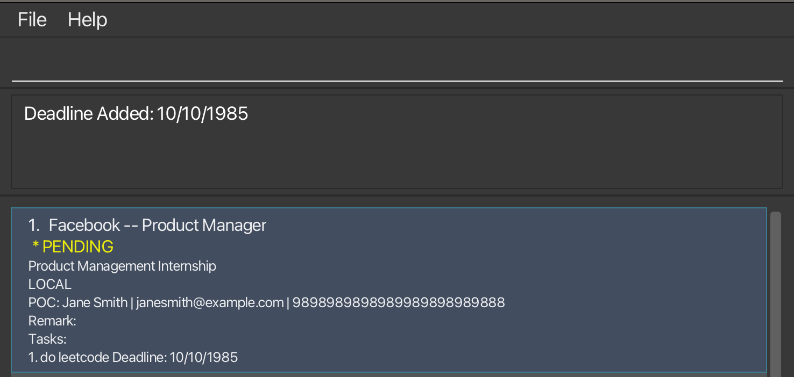  
5. **Edit command will require changes to be made to existing values:** Currently, the edit function allows you to re-enter the values that are already present, without any changes. We plan to add suitable error handling messages to enforce this constraint.
    Command: `edit 1 /com Facebook`
     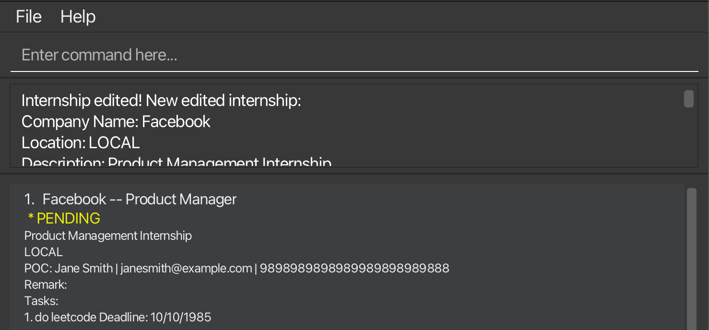  
6. **Editing Multiple fields:** Currently, when the subsequent prefix is incorrect the whole command is recognised as the argument to the first field, leading to errors such as the following. In the future, there will be additional checks to detect this as an invalid prefix error.
    Command: `edit 1 /email john@example.com /n john`
     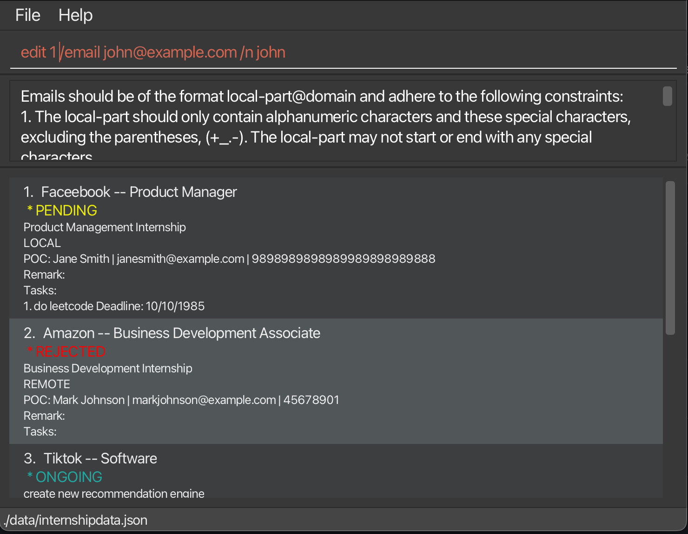  
7. **Consistent filtered lists:** Currently after calling find, if we enter another command it resets to the original list of internships. In the future we want to allow users to layer find, sort and other commands to improve our application's searching functionalities.
    Command: `find withany /status pending`
    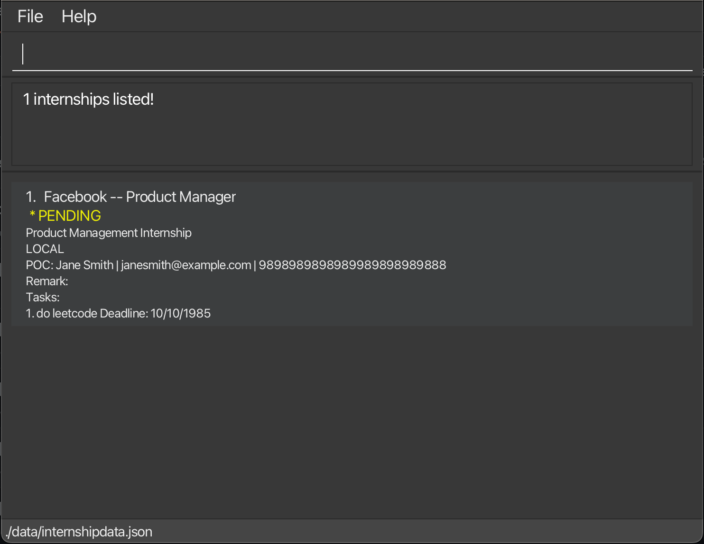
    Command: `edit 1 /com Facebook`
    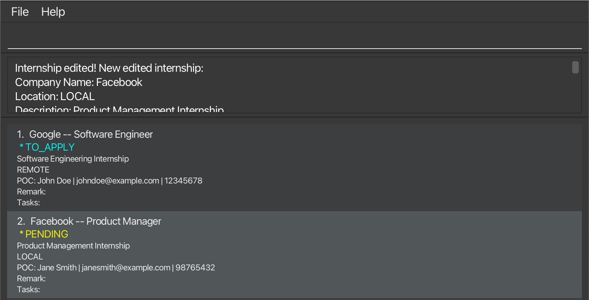  
8. **Additional Checks in the Find Feature:** We will add constraints to the arguments for the find function where we will only allow valid values. We will add suitable error handling to handle these situations.
    Command: `find withany /status invalid_status`
    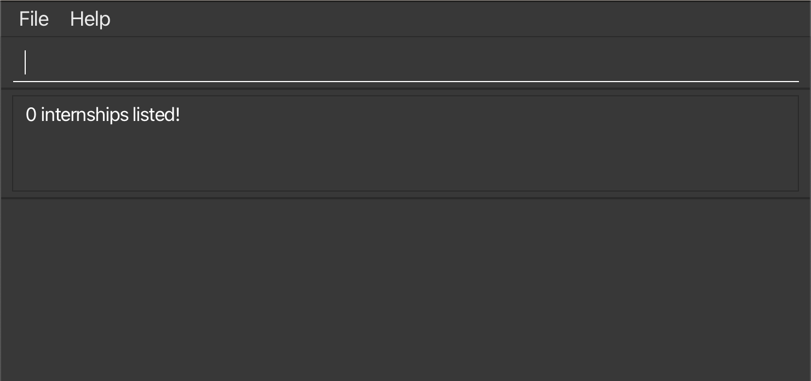  
9. **Allowing more characters in names:** Characters such as - and / are prohibited in the name field. We recognise that these can be part of names and as such hope to add this to the list of allowed characters.  
10. **Detecting space characters between argument's prefix and value:** For example, the command`edit 1 /company`runs successfully and updates the first internship's company field to the value`pany`. This may cause issues when the user misremembers the prefix for an argument. In the future we will implement checks that will check for a space between a prefix and its value.
     Command: `edit 1 /company`
     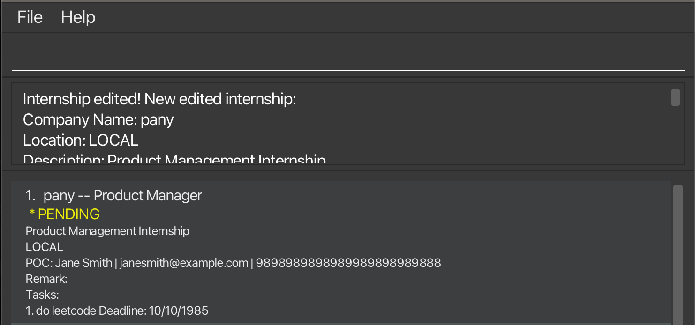  

