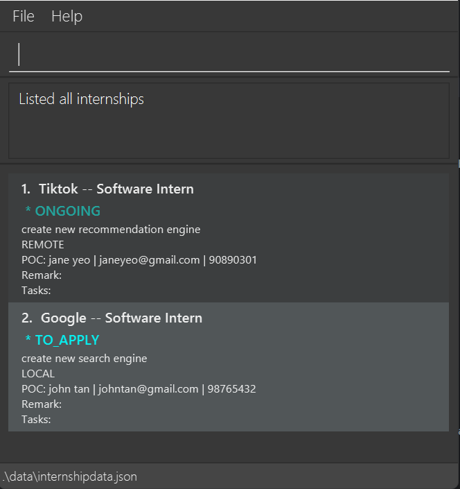
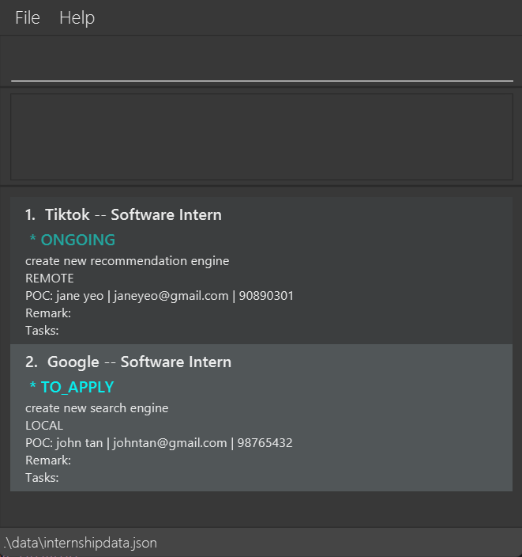
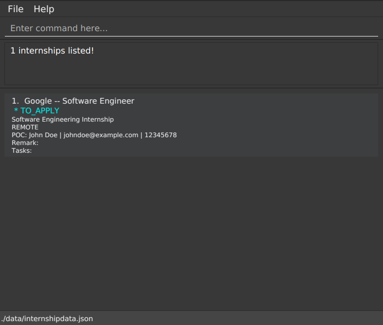
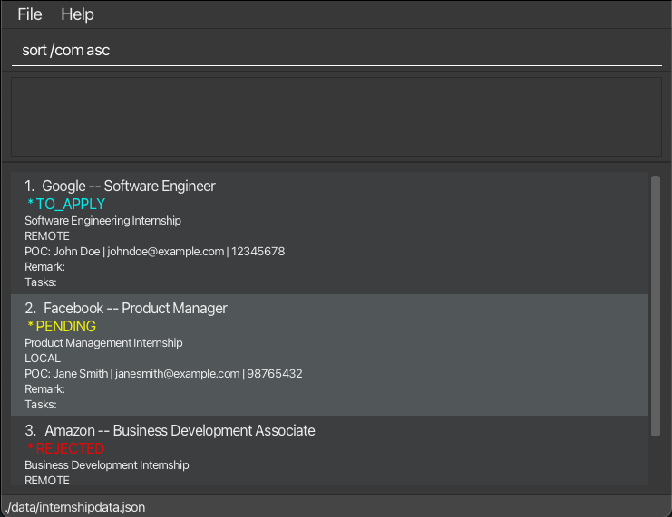
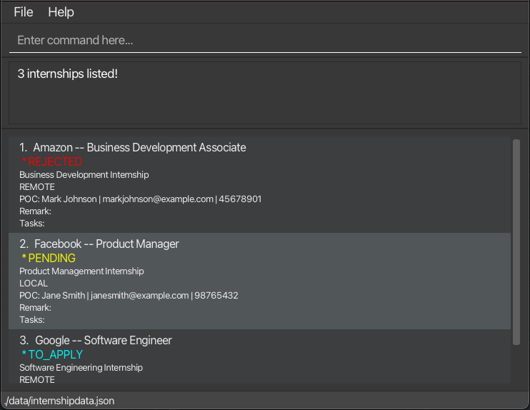
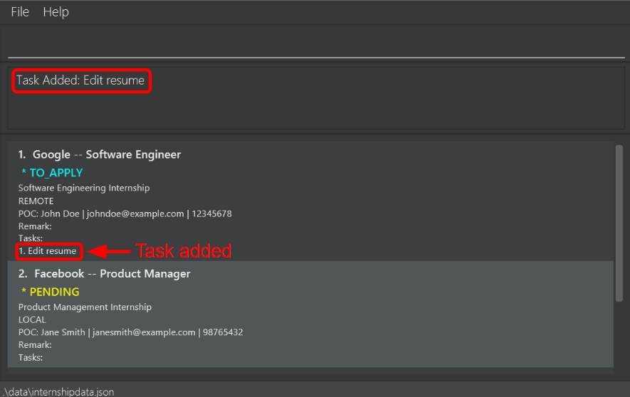
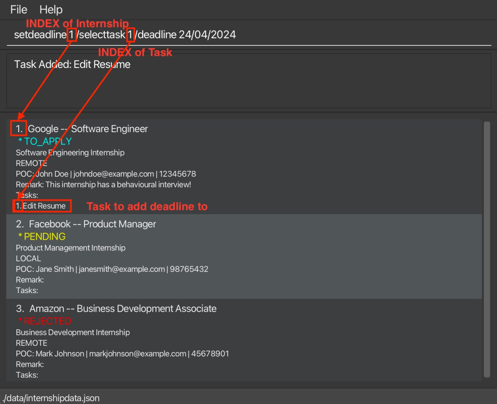
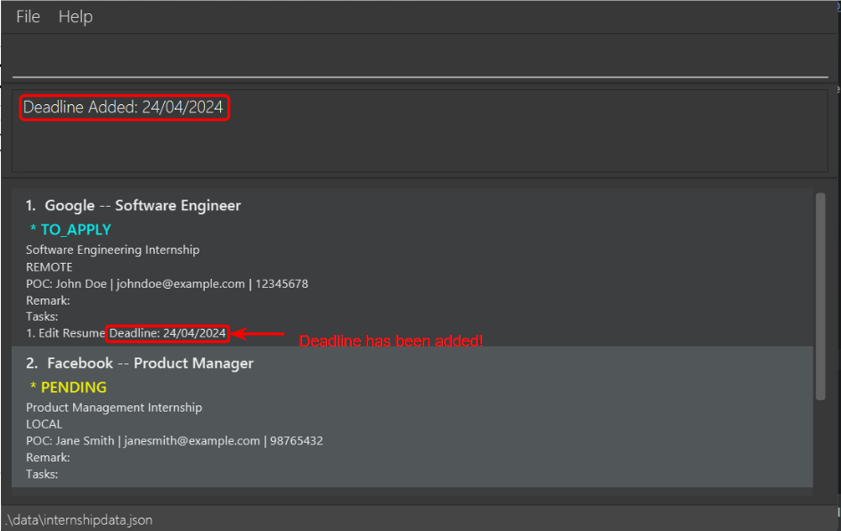
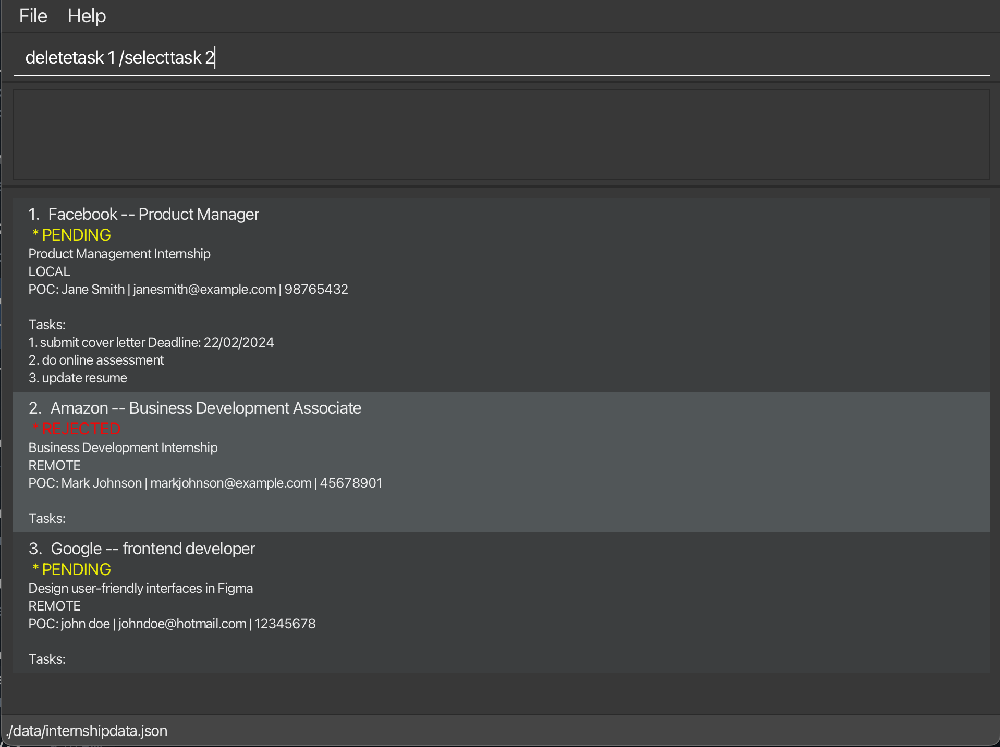

### Table of Contents
1. [Introduction](#introduction)
    - [Who is CareerSync for?](#who-is-careersync-for)
    - [What is the purpose of this User Guide](#what-is-the-purpose-of-this-user-guide)
    - [What can students do with CareerSync?](#what-can-students-do-with-careersync)
2. [Essential Terms & Symbols](#essential-terms--symbols)
    - [Glossary](#glossary)
    - [Legend](#legend)
3. [Quick Start](#quick-start)
    - [Installation](#installation)
    - [Navigating CareerSync](#navigating-careersync)
    - [Tutorial](#tutorial)
4. [Commands](#commands)
    - [Command Summary](#command-summary)
    - [Viewing help](#viewing-help-help)
    - [Adding an internship](#adding-an-internship-add)
    - [Deleting an internship](#deleting-an-internship-delete)
    - [Listing all internships](#listing-all-internships-list)
    - [Editing an internship](#editing-an-internship-edit)
    - [Adding a remark](#adding-a-remark-addremark)
    - [Finding internships by keywords](#finding-internships-by-keywords-find)
    - [Sorting internships by fields](#sorting-internships-by-fields-sort)
    - [Add a Task to an Internship](#add-a-task-to-an-internship-addtask)
    - [Set Deadline to a Task](#set-deadline-to-a-task-setdeadline)
    - [Deleting Tasks from an Internship](#deleting-tasks-from-an-internship-deletetask)
    - [Clearing all internships](#clearing-all-internships-clear)
    - [Exiting the program](#exiting-the-program-exit)
5. [Miscellaneous](#miscellaneous)
    - [Saving and Editing Your Internship Data](#saving-and-editing-your-internship-data)
    - [FAQ](#faq)
    - [Known issues](#known-issues)
    - [Field Summary](#field-summary)

--------------------------------------------------------------------------------------------------------------------

### **Introduction**
Welcome to CareerSync's User Guide!  

CareerSync is an **internship application manager designed to simplify the management of internship applications**. We're here to help 
you keep track of your internships, so you can focus on preparing for your interviews and securing your dream internship! :grin:

#### Who is CareerSync for?
CareerSync is **tailored to NUS Computing students** with **experience in command line interfaces (CLI)**.
Our app is driven by command inputs through the CLI, making it **faster than conventional GUI-based applications.** 

If you are a beginner, don't worry! Our [Quick Start](#quick-start) section will guide you through the installation of all the necessary tools, even if you have never used a CLI before.

#### What is the purpose of this User Guide?
This user guide was created to help students starting out with CareerSync get started with using our application quickly!

**For first-time users**, we recommend starting at the [Quick Start](#quick-start) section to install CareerSync, before heading to the [Tutorial](#tutorial) section.

**For experienced users**, check out the [Commands](#commands) section for a quick reference. 

Do check out our [FAQ](#faq), [Known Issues](#known-issues) and [Glossary](#glossary) sections for more information!

#### What can students do with CareerSync?

As computing students, keeping track of all the internship applications we've made tends to be a hassle. 
With CareerSync, you can:
1. **Add** internships, along with details such as company name, description, status and more!
2. **Find** internships by keywords, making it easy to find the information you need.
3. **Manage tasks** for your applications and keep track of their individual deadlines.
And so much more!

--------------------------------------------------------------------------------------------------------------------

### **Essential Terms & Symbols**

This section explains the common terms that you may not be familiar with, and the symbols used in this User Guide. Read through this section first so that
you understand the contents of this User Guide.

#### Glossary
## Update meaning with short descriptions
| Term      | Meaning                                                                                                                 |
|-----------|-------------------------------------------------------------------------------------------------------------------------|
| CLI       | [Command Line Interface](https://en.wikipedia.org/wiki/Command-line_interface)                                          |
| GUI       | [Graphical User Interface](https://en.wikipedia.org/wiki/Graphical_user_interface)                                      |
| JSON      | [JavaScript Object Notation](https://www.json.org/json-en.html)                                                         |
| JAR       | [Java Archive: A file format to store and distribute Java Applications](https://en.wikipedia.org/wiki/JAR_(file_format)) |
| File Path | [The location of a file in the computer's file system](https://www.w3schools.com/html/html_filepaths.asp)               |

#### Legend
This User Guide contains coloured blocks that highlight important information!

    💡 Green blocks contain examples that you can follow on CareerSync yourself!

    ℹ️ Blue blocks contain tips to enhance your experience using CareerSync!

    ⚠️ 
Red blocks contain warnings to note when using CareerSync!

[Go to Table of Contents](#table-of-contents)

--------------------------------------------------------------------------------------------------------------------
### **Quick Start**
#### Installation
1. Ensure that you have [Java 11 or above](https://www.java.com/en/download/) installed on your computer if you are using Windows.
    - If you are using MacOS, follow the instructions [here](https://nus-cs2103-ay2324s2.github.io/website/admin/programmingLanguages.html) instead.
2. Download the latest `CareerSync.jar` file [here](https://github.com/AY2324S2-CS2103T-W11-1/tp/releases/tag/v1.2). 
## Update link for final 1.3 release^^
3. Make sure your [jar](#glossary) file is located in an empty folder.
4. Start CareerSync.
    - For **MacOS**:
        - Open up your Terminal by typing <kbd>Command</kbd> + <kbd>Space</kbd>, then type `Terminal` and <kbd>Enter</kbd>. 
        - Navigate to the folder containing your jar file using `cd`. If you are not sure how to use `cd`, refer to [this link](https://www.ibm.com/docs/en/aix/7.2?topic=directories-changing-another-directory-cd-command)! 
        - Enter `java -jar CareerSync.jar` and type <kbd>Enter</kbd>.
   - For **Windows**:
       - Open the folder containing `CareerSync.jar`.
       - Double-click on `CareerSync.jar` to start up our application!
5. The **Graphical User Interace** similar to the image below should pop up on your screen.

For more information on the interface, please refer to the [Navigating CareerSync](#navigating-careersync) section.

[Go to Table of Contents](#table-of-contents)

### Navigating CareerSync

When you first start CareerSync, you will see this window. This is the main window of CareerSync, where you can view all your internship applications.

   * `add /com Tiktok /desc create new recommendation engine /status ongoing /poc jane yeo /email hr@tiktok.com
      /phone 90890301 /loc remote /role Software Intern` : Adds this internship entry to the CareerSync application.
#### Areas
The main window of CareerSync is divided into four main areas: the **Tab Area**, the **CLI**, the **Message Box** and the **Internship List Display**.

1. **Tab Area**: The Tab Area contains File and Help, which allows you to navigate its respective functions.
2. **CLI**: The Command Line Interface (CLI) is where you can input commands to interact with CareerSync.
3. **Message Box**: The Message Box displays messages to provide feedback to you.
4. **Internship List Display**: The Internship List Display displays the details of all your internship applications.

#### Internship Fields
The names of the fields for each internship application is as stated below. When you edit these fields, you will see the changes reflected in the display.
For the restrictions on what is accepted for each field, kindly refer to [Fields Summary](#fields-summary).

1. `INDEX` - The index of the internship application in the filtered list.
2. `COMPANY_NAME` - The name of the company you are applying to.
3. `ROLE` - The role you are applying for.
4. `STATUS` - The status of your application.
5. `DESCRIPTION` - A brief description of the internship.
6. `LOCATION` - The location of the internship.
7. `CONTACT_NAME` - The name of the contact person.
8. `CONTACT_EMAIL` - The email of the contact person.
9. `CONTACT_NUMBER` - The phone number of the contact person.

[Go to Table of Contents](#table-of-contents)

--------------------------------------------------------------------------------------------------------------------

### Tutorial
This section would guide you through the basic commands of CareerSync, and how to use them.

#### Clear sample internship entries: `clear`

To begin using CareerSync, you should clear the sample internship entries that are present when you first start the 
application.

Key in the command `clear` in the CLI and press `Enter` to clear the sample internship entries.

💡 **Try It Out:** 

1. Input: 
   `clear` 
     

2. Successful Output after clearing entries: 
   
   There are no more internships in the list.

#### Add an internship entry: `add`

Next, let us try to add an internship entry. 

💡 **Try It Out:** 

Key in the following command in the CLI: `add /com Tiktok /desc create new recommendation engine /status ongoing /poc jane yeo /email hr@tiktok.com
/phone 90890301 /loc remote /role Software Intern`

Successful output after adding the entry: 
   
   You can now see your new internship with the details you entered in the **Internship List Display!**

#### Edit an internship entry: `edit`

Oh no! You made a mistake in the email address of the contact person. Let's edit the email address.

💡 **Try It Out:** 
Key in the following command in the CLI: `edit 1 /email janeyeo@gmail.com`

Successful output after editing the entry: 

Your internship now has the updated email that you keyed in.

#### Find internship entries: `find`

Before you continue, add a few more internship entries using these commands:
1. `add /com Google /desc create new search engine /status to_apply /poc john tan /email johntan@gmail.com /phone 98765432 /loc local /role Software Intern`
2. `add /com Facebook /desc create new social media platform /status to_apply /poc jane tan /email facebookhr@gmail.com /phone 87654321 /loc remote /role Software Intern`

Successful output after adding the entries: 

Let's say you want to find all internships that you want to apply for, that give you a software intern role.
`find` is the command you need!

💡 **Try It Out:** 

Key in the following command in the CLI: `find withall /status to_apply /role Software Intern`

Successful output after finding all entries that satisfy the conditions: 

Your **Internship List Display** now only has all the internships satisfying both conditions.

#### Delete an internship entry: `delete`
You decide that to no longer pursue the internship at Facebook. Let's delete that entry.

💡 **Try It Out:** 

Key in the following command in the CLI: `delete 2`

Successful output after deleting the entry: 

The Facebook internship entry has been removed, and is no longer present in your database.

#### List all internships: `list`
You used find to filter the internships. How do you see all the internships again?

💡 **Try It Out:** 

Key in the following command in the CLI: `list`

Successful output after listing: 

You now see all your internships. Your Tiktok internship, previously hidden, is now back in view.

#### Exit the program: `exit`
You decide that you are done for the day. How do you exit the application and save the file?

💡 **Try It Out:** 

Key in the following command in the CLI: `exit`

Upon reopening the app: 

You now see all your internships that you have when you exited. Your data was saved!

#### Wrapping up the tutorial

This wraps up our tutorial! Hope you now have a better understanding of how to use CareerSync to manage your internship 
applications now.

Only **simple and common use cases** are covered in this tutorial. Please refer to the [Commands](#commands) section so that
you fully understand each command and their usage.

[Go to Table of Contents](#table-of-contents)

____________________________________________________________________________________________________________________
### **Commands**

Let's do a quick review of the commands!

#### Command Summary

| Action                                         | Description                              | Format                                                                                                                                                                                                |
|------------------------------------------------|------------------------------------------|-------------------------------------------------------------------------------------------------------------------------------------------------------------------------------------------------------|
| [help](#viewing-help-help)                     | Get access to the help page              | `help`                                                                                                                                                                                                |
| [add](#adding-an-internship-add)               | Adds an internship.                      | `add /com COMPANY_NAME /desc DESCRIPTION /status STATUS /poc CONTACT_NAME /email CONTACT_EMAIL /phone CONTACT_NUMBER [/loc LOCATION_ENUM] [/role ROLE]`                                               |
| [delete](#deleting-an-internship-delete)       | Removes a internship.                    | `delete INDEX`                                                                                                                                                                                        |
| [list](#listing-all-internships-list)          | Lists all internships.                   | `list`                                                                                                                                                                                                |
| [edit](#editing-an-internship-edit)            | Modifies an existing internship.         | `edit INDEX [/com COMPANY_NAME] [/poc CONTACT_NAME] [/email CONTACT_EMAIL] [/phone CONTACT_NUMBER] [/loc LOCATION_ENUM] [/status STATUS] [/desc DESCRIPTION] [/role ROLE] [/remark REMARK]`           |
| [addremark](#adding-a-remark-addremark)        | Adds a remark to an existing internship. | `addremark INDEX [/remark REMARK]`                                                                                                                                                                    |
| [find](#finding-internships-by-keywords-find)  | Finds an internship by keywords.         | `find MODE [/com COMPANY_NAME_KEYWORDS] [/poc CONTACT_NAME_KEYWORDS] [/loc LOCATION_KEYWORDS] [/status STATUS_KEYWORDS] [/desc DESCRIPTION_KEYWORDS] [/role ROLE_KEYWORDS] [/remark REMARK_KEYWORDS]` |
| [sort](#sorting-internships-by-fields-sort)    | Sorts the internships by fields.         | `sort FIELD ORDER`                                                                                                                                                                                    |
| [addtask](#add-a-task-to-an-internship-addtask) | Adds a task to an internship.            | `addtask INDEX /task TASK`                                                                                                                                                                            |
| [setdeadline](#set-deadline-to-a-task-setdeadline) | Sets a deadline to a task.               | `setdeadline INDEX_INTERNSHIP /selecttask INDEX_TASK /deadline DEADLINE`                                                                                                                              |
| [deletetask](#deleting-tasks-from-an-internship-deletetask) | Deletes a task from an internship.       | `deletetask INDEX_INTERNSHIP /selecttask INDEX_TASK`                                                                                                                                                  |
| [clear](#clearing-all-internships-clear)       | Removes all internships from the app.    | `clear`                                                                                                                                                                                               |
| [exit](#exiting-the-program-exit)              | Exits and closes the application.        | `exit`                                                                                                                                                                                                |

**Notes about the command format** 

* `INDEX` refers to the index of the internship in the list. It must be a positive integer (like 1, 2, 3 …) and one of 
the displayed internship indexes.

* Items in square brackets are optional. 
  e.g `/com COMPANY_NAME [/desc DESCRIPTION]` can be used as `/com Alibaba /desc Free shipping for employees` or as `/com Alibaba`.

* Parameters can be in any order. 
  e.g. if the command specifies `/com COMPANY_NAME /desc DESCRIPTION`, `/desc DESCRIPTION /com COMPANY_NAME` is also acceptable.

* If you are using a PDF version of this document, be careful when copying and pasting commands that span multiple lines
  as space characters surrounding line-breaks may be omitted when copied over to the application.

#### Viewing help: `help`

If you ever get lost or need a refresher on the commands, you can always use the `help` command to view the help message. 
This directs you to the User Guide (this page!), where you can find all the information you need to use CareerSync.

Format: `help`

#### Adding an internship: `add`
Lets you add an internship entry to be tracked by CareerSync!

**Format:** `add /com COMPANY_NAME /desc DESCRIPTION /status STATUS /poc CONTACT_NAME /email CONTACT_EMAIL /phone CONTACT_NUMBER [/loc LOCATION_ENUM] [/role ROLE] ​`  

* The fields `COMPANY_NAME`, `DESCRIPTION`, `CONTACT_NAME` and `ROLE` allow the use of any text, number and/or spaces
* The field `STATUS` accepts only the following inputs: `to_apply`, `ongoing`, `rejected`, `accepted` (case-insensitive)
* The field `CONTACT_EMAIL` accepts only the format of `<email>@<domain>.com`
* The field `CONTACT_NUMBER` must be unsigned, and it must be at least 3 digits long
* The field `LOCATION_ENUM` accepts only the following inputs: `remote`, `local`, `overseas` (case-insensitive)

ℹ️ **Tip:** If you haven't already, head over to the [Tutorial](#add-an-internship-entry-add) section to learn how to add an internship entry !

⚠️ **Common errors:**  

1. If you miss out any of the mandatory fields, the command will be rejected with an error message.
Make sure to refer to the error message displayed for the correct format to use! 
2. If you input an invalid status, location or email format, the command will be rejected with an error message highlighting the valid values.  

[Go to Field Summary](#field-summary) | [Go to Command Summary](#command-summary) | [Go to Table of Contents](#table-of-contents)

#### Deleting an internship: `delete`
Lets you delete an internship entry from CareerSync.

Format: `delete INDEX`

* Deletes the internship at the specified `INDEX`.
* The index refers to the index number shown in the displayed list of internship entries at point of deletion.
* The index **must be a positive integer** 1, 2, 3, …​

ℹ️ **Tip:** If you haven't already, head over to the [Tutorial](#delete-an-internship-entry-delete) section to learn how to delete an internship entry !

⚠️ **Common errors:**  
1. If you input an index that is not one of the displayed internship indexes, the command will not be executed and an error message will be displayed.

[Go to Field Summary](#field-summary) | [Go to Command Summary](#command-summary) | [Go to Table of Contents](#table-of-contents)

#### Listing all internships: `list`

Shows you a list of all your internships tracked by CareerSync.

**Format:** `list`

💡 **Try It Out:** 
When you first start the application, you will see a list of all the internships you have added.  
The [find](#finding-internships-by-keywords-find) command might be used to filter the visible list of internships.  
If you want to see all internships again, simply type `list` and press enter.
  

1. Input: 
   `list` 
   
In this example, the current view shows only internships with location 'REMOTE'.
  

2. Successful Output after executing list:  
   
Any present filter will be removed, and all internships will be displayed in the list.

ℹ️ **Tip:** If you can't seem to find an internship you added, try using `list` to see all your internships.
You may have had a filter applied that is hiding the internship you are looking for.

[Go to Field Summary](#field-summary) | [Go to Command Summary](#command-summary) | [Go to Table of Contents](#table-of-contents)

#### Viewing an internship entry's details

When you click on an internship entry in the internship list, a separate window will be open showing
the detailed view of the internship entry. 
This view will show all the fields of the internship entry in a bigger font size for easier reading. 
 

ℹ️ **Tip:** This feature is not recommended for efficient use of the application, as it is not a command that can be inputted into the CLI.
However, it serves as an aid to view the details of an internship entry in a more readable format.

[CLI](#glossary) input will be implemented in a future release.

[Go to Field Summary](#field-summary) | [Go to Command Summary](#command-summary) | [Go to Table of Contents](#table-of-contents)

#### Editing an internship: `edit`

Lets you edit an existing internship entry in CareerSync.

**Format** : `edit INDEX [/com COMPANY_NAME] [/poc CONTACT_NAME] [/email CONTACT_EMAIL] [/phone CONTACT_NUMBER] [/loc LOCATION_ENUM] [/status STATUS] [/desc DESCRIPTION] [/role ROLE] [/remark remark] …​`

* Edits the internship at the specified `INDEX`. The index refers to the index number shown in the displayed internship list. The index **must be a positive integer** 1, 2, 3, …​
* At least one of the optional fields must be provided. 
* Multiple fields can be edited at once.
* Existing values will be updated to the input values.
* Only valid field values will be accepted. For example, you cannot set the status to 'ghosted' as it is not a valid status.

💡 **Try It Out:** 

1. Input: 
   `edit 1 /email tiktok@gmail.com` 
     

2. Successful Output after clearing entries: 
   
   The email field of the first internship is successfully updated to `tiktok@gmail.com`.

⚠️ **Common errors:**  
1. Make sure not to miss out the mandatory `INDEX` field. If you do, CareerSync won't know which internship to edit!

[Go to Field Summary](#field-summary) | [Go to Command Summary](#command-summary) | [Go to Table of Contents](#table-of-contents)

#### Adding a remark: `addremark`

You can use this to add a remark or modify an existing one, of the internship at the specified `INDEX`.
Use this to keep track of your personal notes about the internship!

**Format:** `addremark INDEX /remark REMARK`

* `INDEX` refers to the index in the internship list and **must be a positive integer** 1, 2, 3, …

💡 **Try It Out:** 

1. Input: 
   `addremark 1 /remark This internship has a behavioural interview!` 
     

2. Successful Output after adding a remark: 
   
This sets the remark of the internship at index 1 to be `This internship has a behavioural interview!`.

ℹ️ **Tip:** To delete an existing remark, simply input an empty string as the remark like so:  `addremark INDEX /remark`.

⚠️ **Common errors:**  
1. Don't forget to have the `/remark` prefix before the remark you want to add.

[Go to Field Summary](#field-summary) | [Go to Command Summary](#command-summary) | [Go to Table of Contents](#table-of-contents)

#### Finding internships by keywords: `find`

You can use this to filter the visible internships in CareerSync by keywords.

**Format:** `find MODE [/com COMPANY_NAME_KEYWORDS] [/poc CONTACT_NAME_KEYWORDS] [/loc LOCATION_KEYWORDS] [/status STATUS_KEYWORDS] [/desc DESCRIPTION_KEYWORDS] [/role ROLE_KEYWORDS] [/remark REMARK_KEYWORDS]`

* MODE is either 'withall' or 'withany'.
  * 'withall' returns internships that match each prefix-keyword predicate.
    * Within each prefix field that you specified, the internship just has to contain any of the keywords.
  * 'withany' returns internships that match at least one prefix-keyword predicate.
* The search is case-insensitive. e.g `google` will match `Google`
* The order of the keywords does not matter. e.g. `Microsoft Google` will match `Google Microsoft`
* Only full words will be matched e.g. `Goo` will not match `Google`
* Internship matching at least one keyword will be returned (i.e. `OR` search).
  e.g. `Hewlett Song` will return `Hewlett Packard`, `Song Fa`

💡 **Try It Out:** 

1. Input: 
   `find withall /status to_apply /loc remote` 
    
This will filter the list of internships to show you only those with both status `TO_APPLY` and location `REMOTE`.  

2. Successful Output after filtering: 
     

3. Other examples: 
   i.`find withany /com Google /loc local` shows you internships with either company name (case-insensitive) `Google` or location `LOCAL` 
   ii.`find withall /poc John /desc paperwork` shows you internships with both contact name (case-insensitive) `John` and description containing `paperwork`

ℹ️ **Tip:** If you want to view all internships again, simply use the [list](#listing-all-internships-list) command.

⚠️ **Common errors:**  

1. If you do not specify any field prefixes, or specified an invalid field prefix, the command will be rejected with error message: 
   `At least one supported field prefix and keyword must be specified to be searched.
   Supported prefixes are /com, /poc, /loc, /status, /desc, /role, /remark` 
2. Make sure you specify the MODE of search, which must be either `withall` or `withany`. If not, the command will be rejected with error message: 
`Invalid mode specified. Please specify either 'withall' or 'withany'.` 

[Go to Field Summary](#field-summary) | [Go to Command Summary](#command-summary) | [Go to Table of Contents](#table-of-contents)

#### Sorting internships by fields: `sort`
This command allows you to sort the internships in CareerStnc by the specified field in ascending or descending order.

**Format:** `sort FIELD ORDER`

* FIELD is the field to sort by. It is case-sensitive. The list of valid fields can be found [here](#field-summary).
    * `/status` has an implicit ordering, in ascending order: `TO_APPLY` -> `ONGOING` -> `PENDING` -> `ACCEPTED` -> `REJECTED`.
    * The rest of the fields are sorted in alphanumeric order. (A before Z, 0 before 9)
* ORDER is either `asc` or `desc`.
    * `asc` sorts the internships in ascending order.
    * `desc` sorts the internships in descending order.

💡 **Try It Out:** 

1. Input: 
   `sort /com asc` 
    
This will sort the list of internships by company name in ascending order. 
 

2. Successful Output after sorting: 
     

3. Other examples: 
   i.`sort /status asc` sorts your internships in the following order: `TO_APPLY` -> `ONGOING` -> `PENDING` -> `ACCEPTED` -> `REJECTED` 
   ii.`sort /phone asc` sorts your internships in ascending order of phone numbers.

⚠️ **Common errors:**  

1. Don't forget to specify the ORDER of sorting, which must be either `asc` or `desc`.

[Go to Field Summary](#field-summary) | [Go to Command Summary](#command-summary) | [Go to Table of Contents](#table-of-contents)

#### Add a Task to an Internship: `addtask`

Using this function, you can add a task to an internship so that you won't forget to complete it!

**Format:** `addtask INDEX /task TASK`

- `TASK` is the task you want to add to the internship.

💡 **Try It Out:** 

1. Input: 
   `addtask 1 /task Edit Resume` 
    

2. Successful Output after deleting task: 
     

ℹ️ **Tip:** You cannot add a task using the `add` command. You must use the `addtask` command to add a task to an internship.

⚠️ **Common errors:**  
1. The index must be a positive integer (like 1, 2, 3 …) and one of the displayed internship indexes. If not, the command will be rejected.
Refer to the error message displayed for the correct format to use!

[Go to Field Summary](#field-summary) | [Go to Command Summary](#command-summary) | [Go to Table of Contents](#table-of-contents)

#### Set Deadline to a Task: `setdeadline`

Using this function, you can set the deadline to a task under an internship so that you won't miss the deadline!

**Format:** `setdeadline INDEX_INTERNSHIP /selecttask INDEX_TASK /deadline DEADLINE`

- `INDEX_INTERNSHIP` is the index of the internship with the task you want to set the deadline for.
- `INDEX_TASK` is the index of the task that you want to set the deadline for.
- `DEADLINE` is the deadline you want to set for the task. It must be in the format `DD/MM/YYYY`, and a valid date.

💡 **Try It Out:** 
Before you try this command, you need an internship that has at least 1 task. You can add it by using the [addtask](#add-a-task-to-an-internship-addtask) command.  
1. Input: 
   `setdeadline 1 /selecttask 1 /deadline 24/04/2024` 
    

2. Successful Output after adding deadline: 
     

ℹ️ **Tip:** Once you set a deadline to a task, you can't remove it! You can only change the deadline using this command.

⚠️ **Common errors:**  
1. Don't forget that you need to include both the internship index and the task index!
2. If your day or month is single-digit, remember to include a leading zero. For example, `01/04/2024` instead of `1/4/2024`.

[Go to Field Summary](#field-summary) | [Go to Command Summary](#command-summary) | [Go to Table of Contents](#table-of-contents)

#### Deleting Tasks from an Internship: `deletetask`

Lets you delete a task from an existing internship after it is complete!

**Format:** `deletetask INDEX /selecttask TASK_INDEX`

- `INDEX` and `TASK_INDEX` denote the internship index and task index respectively.

💡 **Try It Out:** 

1. Input: 
   `deletetask 1 /selecttask 2` 
    

2. Successful Output after deleting task: 
     

⚠️ **Common errors:**  
1. Don't forget that you need to include both the internship index and the task index!

[Go to Field Summary](#field-summary) | [Go to Command Summary](#command-summary) | [Go to Table of Contents](#table-of-contents)

#### Clearing all internships: `clear`

This clears all your internship entries from CareerSync.

⚠️ Caution:
This operation is irreversible. Once you clear all entries, you cannot undo it.

**Format:** `clear`

💡 **Try It Out:** 

1. Input: 
   `clear` 
     

2. Successful Output after clearing entries: 
   
There are no more internships in the list.

[Go to Field Summary](#field-summary) | [Go to Command Summary](#command-summary) | [Go to Table of Contents](#table-of-contents)

#### Exiting the program: `exit`

When you're done using CareerSync, you can exit the application using this command.

Format: `exit`

[Go to Field Summary](#field-summary) | [Go to Command Summary](#command-summary) | [Go to Table of Contents](#table-of-contents)

 

#### Saving and Editing Your Internship Data

⚠️ Caution:
Users are **NOT** recommended to modify their data file directly, since wrong formatting will cause the app to malfunction.
Only do so if you are an experienced user!  

CareerSync data is saved in the hard disk, as a [JSON](#glossary) file at the path 
`[JAR file location]/data/internshipdata.json`. After every command that changes the data, CareerSync performs a save automatically. There is no need to save manually.

[Go to Field Summary](#field-summary) | [Go to Command Summary](#command-summary) | [Go to Table of Contents](#table-of-contents)

--------------------------------------------------------------------------------------------------------------------
## **Miscellaneous**
### FAQ

**Q**: How do I transfer my data to another Computer? 
**A**: Do the following steps:   1. Navigate to the folder where CareerSync.jar is stored.   2. Copy your data file from data/internshipdata.json.   3. Install the app in the other computer and overwrite the empty data file (data/internshipdata.json) it creates with the file that contains the data (JSON file) of your previous CareerSync home folder.

[Go to Table of Contents](#table-of-contents)

--------------------------------------------------------------------------------------------------------------------

### Known issues

1. **When using multiple screens**, if you move the application to a secondary screen, and later switch to using only the primary screen, the GUI will open off-screen. 
**The solution** is to delete the `preferences.json` file from the folder where you installed the application. Then, run the application again.

[Go to Table of Contents](#table-of-contents)

--------------------------------------------------------------------------------------------------------------------

### Field Summary

| Field Name | Description                         | Valid Inputs                                                                                                                                                                                                                                                                                                                                                                                                                                                                                                                                |
|------------|-------------------------------------|---------------------------------------------------------------------------------------------------------------------------------------------------------------------------------------------------------------------------------------------------------------------------------------------------------------------------------------------------------------------------------------------------------------------------------------------------------------------------------------------------------------------------------------------|
| `/com`     | Company Name                        | Any text, numbers, or spaces                                                                                                                                                                                                                                                                                                                                                                                                                                                                                                                |
| `/desc`    | Description of Internship           | Any text, numbers, or spaces                                                                                                                                                                                                                                                                                                                                                                                                                                                                                                                |
| `/status`  | Status of Application               | `to_apply`, `ongoing`, `rejected`, `accepted`                                                                                                                                                                                                                                                                                                                                                                                                                                                                                               |
| `/poc`     | Name of Person of Contact           | Any text, numbers, or spaces                                                                                                                                                                                                                                                                                                                                                                                                                                                                                                                |
| `/email`   | Email of Person of Contact          | Valid format: `local-part@domain` - The local-part should only contain alphanumeric characters and these special characters: `!#$%&'*+-/=?^_{ \|}~`. It may start or end with any special characters. - The domain name is made up of domain labels separated by periods. The domain name must:  * End with a domain label at least 2 characters long   * Have each domain label start and end with alphanumeric characters  * Have each domain label consist of alphanumeric characters, separated only by hyphens, if any. |
| `/phone`   | Contact Number of Person of Contact | At least 3 numbers                                                                                                                                                                                                                                                                                                                                                                                                                                                                                                                          |
| `/loc`     | Location of Internship              | `remote`, `local`, `overseas`                                                                                                                                                                                                                                                                                                                                                                                                                                                                                                               |
| `/role`    | Role for the Internship             | Any text, numbers, or spaces                                                                                                                                                                                                                                                                                                                                                                                                                                                                                                                |
| `/remark`  | Remark for the Internship           | Any text, numbers, or spaces                                                                                                                                                                                                                                                                                                                                                                                                                                                                                                                |
| `/task`    | Task for the Internship             | Any text, numbers, or spaces                                                                                                                                                                                                                                                                                                                                                                                                                                                                                                                |
| `/deadline`| Deadline for the Task               | Valid format: `DD/MM/YYYY` - The date must be a valid date.                                                                                                                                                                                                                                                                                                                                                                                                                                                                              |

[Go to Table of Contents](#table-of-contents)
